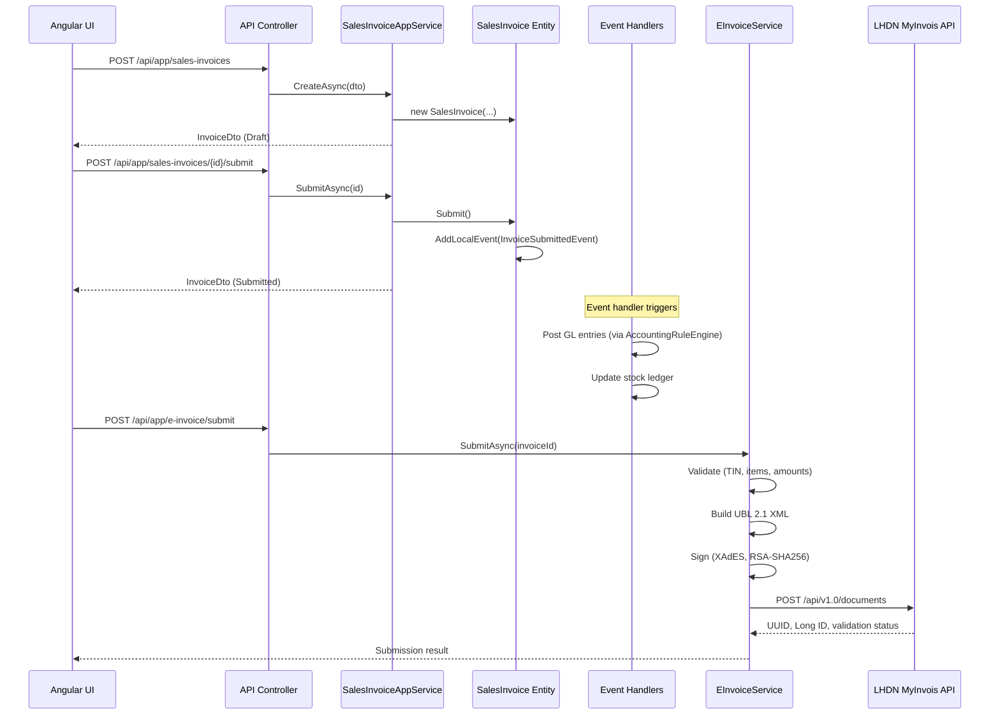

# MyERP — Architecture Documentation

## System Architecture

```
┌─────────────────────────────────────────────────────────────┐
│                        Clients                               │
│  ┌──────────────┐  ┌──────────────┐  ┌──────────────────┐  │
│  │ Angular SPA  │  │ Mobile (PWA) │  │ External Systems │  │
│  └──────┬───────┘  └──────┬───────┘  └────────┬─────────┘  │
└─────────┼──────────────────┼───────────────────┼────────────┘
          │                  │                   │
          ▼                  ▼                   ▼
┌─────────────────────────────────────────────────────────────┐
│                    Reverse Proxy (Traefik)                    │
│                    TLS Termination, Rate Limiting             │
└─────────────────────────┬───────────────────────────────────┘
                          │
          ┌───────────────┼───────────────┐
          ▼                               ▼
┌──────────────────────┐       ┌──────────────────────┐
│   API Host (.NET 10) │       │   Angular (Nginx)    │
│   ──────────────────  │       │   Static SPA files   │
│   • OpenIddict Auth   │       └──────────────────────┘
│   • REST Controllers  │
│   • Swagger/OpenAPI   │
│   • Health Checks     │
└──────────┬────────────┘
           │
     ┌─────┼─────────────────────────────┐
     ▼                                   ▼
┌──────────────┐                ┌──────────────┐
│  PostgreSQL  │                │    Redis     │
│  (Primary)   │                │  (Cache/Bus) │
└──────────────┘                └──────────────┘
```

## Application Layers (ABP DDD)

```
┌──────────────────────────────────────────────────────────────┐
│  Presentation Layer                                           │
│  ├── MyERP.HttpApi.Host    (ASP.NET Core host, middleware)   │
│  ├── MyERP.HttpApi         (API Controllers)                 │
│  └── Angular App           (SPA Frontend)                    │
├──────────────────────────────────────────────────────────────┤
│  Application Layer                                            │
│  ├── MyERP.Application.Contracts  (DTOs, Interfaces, Perms)  │
│  └── MyERP.Application            (AppService implementations)│
├──────────────────────────────────────────────────────────────┤
│  Domain Layer                                                 │
│  ├── MyERP.Domain.Shared   (Enums, Constants, Error Codes)   │
│  └── MyERP.Domain          (Entities, Domain Services, Events)│
├──────────────────────────────────────────────────────────────┤
│  Infrastructure Layer                                         │
│  └── MyERP.EntityFrameworkCore  (DbContext, Repos, Migrations)│
└──────────────────────────────────────────────────────────────┘
```

## Module Map

| Module | Namespace | Table Prefix | Description |
|--------|-----------|--------------|-------------|
| Core | `MyERP.Core` | `App` | Company, Branch, Document Series |
| Accounting | `MyERP.Accounting` | `Acc_` | Chart of Accounts, Journal Entries, Fiscal Years, Payment Entries |
| Sales | `MyERP.Sales` | `Sal_` | Quotations, Sales Orders, Delivery Notes, Sales Invoices |
| Purchasing | `MyERP.Purchasing` | `Pur_` | Purchase Orders, Purchase Receipts, Purchase Invoices |
| Inventory | `MyERP.Inventory` | `Inv_` | Items, Warehouses, Stock Entries, Stock Ledger |
| Tax | `MyERP.Tax` | `Tax_` | Tax Categories, Tax Rules, SST |
| HR | `MyERP.HumanResources` | `Hr_` | Employees, Payroll, Contribution Rules |
| E-Invoice | `MyERP.EInvoice` | `EInv_` | LHDN Integration, Submissions, Success Logs |
| CRM | `MyERP.CRM` | `CRM_` | Leads, Opportunities |
| Projects | `MyERP.Projects` | `Prj_` | Projects, Tasks, Dependencies |
| Assets | `MyERP.Assets` | `Ast_` | Fixed Assets, Depreciation |
| Manufacturing | `MyERP.Manufacturing` | `Mfg_` | Bills of Material, Work Orders |
| Workflow | `MyERP.Workflow` | `Wf_` | Approval Rules, Approval Requests |
| Automation | `MyERP.Automation` | `Auto_` | Automation Rules, Execution Logs |
| Notifications | `MyERP.Notifications` | `App_` | In-App Notifications |
| Import/Export | `MyERP.ImportExport` | `App_` | Import Jobs |

## Data Flow — Sales Invoice Lifecycle



## Security Architecture

- **Authentication**: OpenIddict (OAuth 2.0 / OIDC) with ABP Identity module
- **Authorization**: ABP Permission System — every AppService method requires specific permissions
- **Data Isolation**: Multi-tenancy with per-tenant data filtering (IMultiTenant interface)
- **PDPA Compliance**: Field-level security for sensitive data (IC, bank details, salary)
- **Audit Trail**: Full audit logging on all entities (CreatedBy, ModifiedBy, DeletedBy timestamps)
- **Input Validation**: Data Annotations + FluentValidation on all DTOs
- **CSRF Protection**: ABP anti-forgery tokens
- **SQL Injection**: EF Core parameterized queries only — no raw SQL concatenation

## Key Design Decisions

1. **Rules Engine over Hardcoding** — Tax rates, accounting rules, and contribution tables are data-driven entities, not code constants.
2. **Double-Entry Accounting** — Every financial transaction must produce balanced journal entries (validated at domain level).
3. **Immutable Transactions** — Posted documents are never deleted; cancellation creates reversal entries.
4. **Event-Driven Side Effects** — Domain events decouple document submission from GL posting, stock updates, and notifications.
5. **Document Workflow Pattern** — All transactable documents follow: Draft → Submitted → Approved → Posted → [Cancelled].
